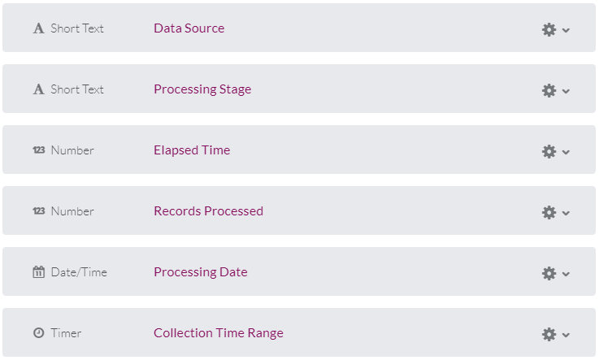
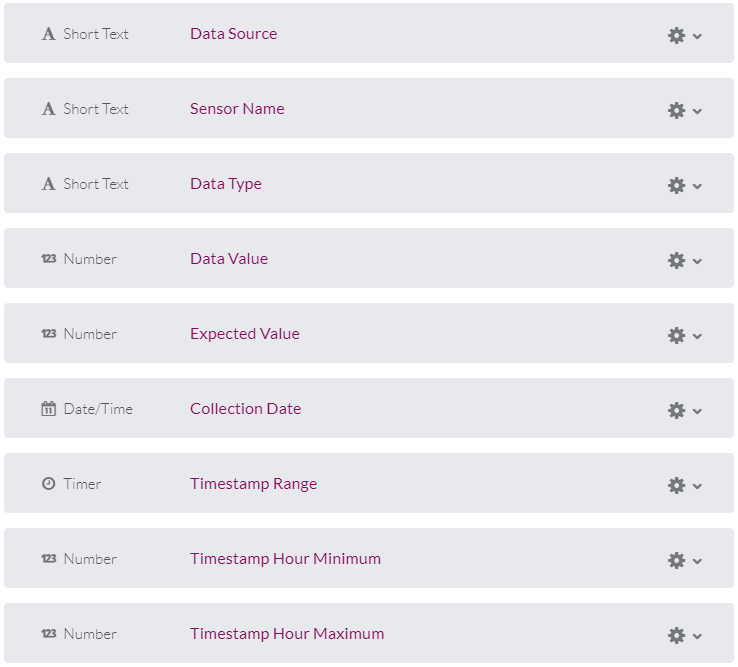
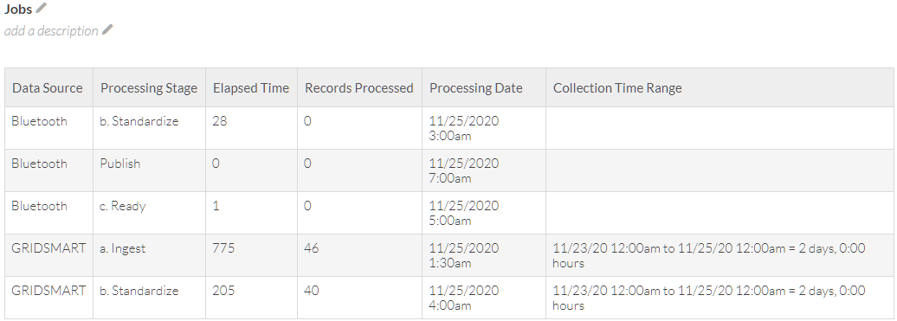
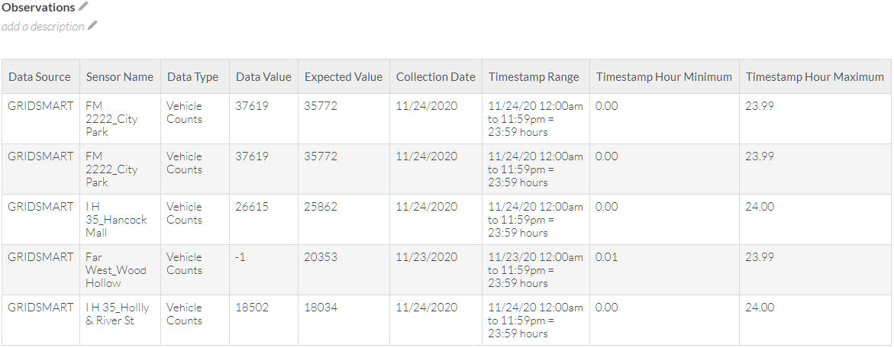
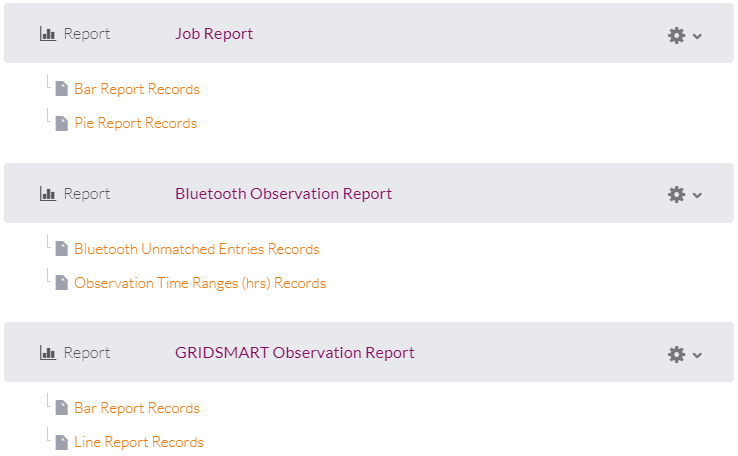
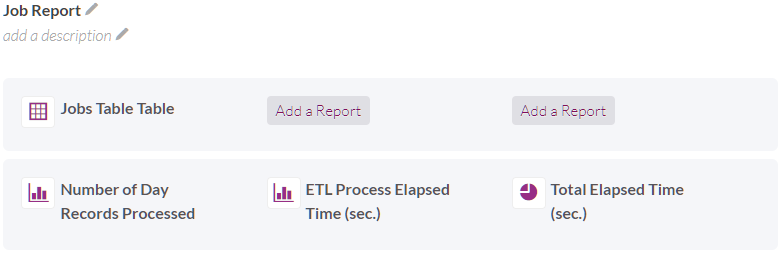
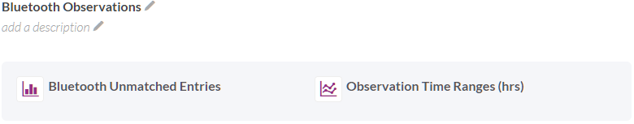

# Appendix: Performance Metrics

Performance metrics in the ETL processes looks like:

* Logging the numbers of records manipulated for each day in each ETL process
* During the JSON Canonicalization stage, logging a representative metric for each unit handled within the data source

The main purposes of logging these is to understand the overall health of the system, so that visualizations can be shown in a dashboard format. If entire ETL stages fail, then they should be obviously absent from the dashboard. If measurements for units are missing (e.g. intersections are out for GRIDSMART) or are significantly off from the average, then it should also be evident on the dashboard.

This document describes the metrics that are created, the efforts in Knack to visualize them (which can conceivably be duplicated using other visualization platforms), and has technical notes on creating the database tables that store the daily metrics.

## Database Creation

The "perfmet tables" consist of two tables: one that deals with processing jobs (containing an update for each processing stage completed per day), and one that deals with observations (containing a sample of data that can indicate the overall health of each sensor type's sampling, such as total vehicle count at an intersection).

```sql
CREATE TABLE api.etl_perfmet_job (
  id serial,
  data_source varchar NOT NULL,
  stage varchar NOT NULL,
  seconds real,
  records integer,
  processing_date timestamp with time zone NOT NULL,
  collection_start timestamp with time zone,
  collection_end timestamp with time zone,
  PRIMARY KEY (processing_date, data_source, stage)
);

COMMENT ON TABLE api.etl_perfmet_job IS
  'Austin Transportation performance metrics job log';

GRANT ALL ON api.etl_perfmet_job TO super_user;
GRANT USAGE, SELECT ON SEQUENCE api.etl_perfmet_job_id_seq TO super_user;
```

These are the definitions for each of the columns:

* **id:** Automatically generated unique identifier
* **data_source:** Signifies the data source, such as "Bluetooth"
* **stage:** Signifies the processing stage, such as "Ingest". This is defined in the variouus ETL processing layers.
* **seconds:** Notes the run time for the ETL process
* **records:** Notes the number of records processed, as reported by the ETL process
* **processing_date:** Date that the ETL process ran
* **collection_start:** Identifies the timestamp for the first data element processed
* **collection_end:** Identifies the timestamp for the last data element processed

Now for the observations table:

```sql
CREATE TABLE api.etl_perfmet_obs (
  id serial,
  data_source varchar NOT NULL,
  sensor_name varchar NOT NULL,
  data_type varchar NOT NULL,
  data real,
  expected real,
  collection_date timestamp with time zone NOT NULL,
  timestamp_min timestamp with time zone,
  timestamp_max timestamp with time zone,
  PRIMARY KEY (collection_date, data_source, data_type, sensor_name)
);

COMMENT ON TABLE api.etl_perfmet_obs IS
  'Austin Transportation performance metrics observation log';

GRANT ALL ON api.etl_perfmet_obs TO super_user;
GRANT USAGE, SELECT ON SEQUENCE api.etl_perfmet_obs_id_seq TO super_user;
```

These are what each column does:

* **id:** Automatically-generated unique identifier
* **data_source:** Same as the jobs table, identifies the data source, such as "Bluetooth"
* **sensor_name:** A string that identifies a sensor for the data source; usually an intersection name
* **data_type:** Identifies what the value stored in the "data" field represents
* **data:** The metric that had been collected, such as number of records or vehicle volume
* **expected:** Indicates the expected value for the "data" field; can be a running average over the previous 7 days. This can be null if there is no expected value recorded. This is ignored if the calcExpected field is `True` when calling `perfmet_knack.processObs()`.
* **collection_date:** The timestamp for when this metric was recorded
* **timestamp_min:** Timestamp of the earliest operation that contributed to the metric
* **timestamp_max:** Timestamp of the latest operation that contributed to the metric. The idea is to find if there is a time that the data collection on the location/sensor was inactive.

## Recording Performance Metrics

The recording of performance metrics is facilitated by the support.perfmet package. See more about how this is used in the [Code Architecture](code_architecture.md) document.

## Feeding Data to Knack

The "utils/perfmet_knack.py" script is automatically run every morning after all the ETL processes are (supposedly) complete. In that process, old data in Knack are cleared out, records are read out of the database tables, and new data are fed to Knack. One of the important things to note about the script is that the Knack field names are defined in constant dictionaries toward the top of the Python file.

Knack has a couple characteristics that require special treatment when communicating from the Python script. First, users of the API are warned that a maximum of 10 requests to the Knack API per second are allowed. This is enforced through the `regulate()` method; however, in reality, the service rate for a single thread of requests to Knack end up taking far fewer than that rate... no more than 2. This method also performs error handling that will automatically retry failed API requests; that appears to be necessary because communications to the Knack API can be a little unreliable. Second, daily limits on API requests are enforced unless requests are made to publicly accessible "view-based" objects. So, that's what is set up for the dashboard data view objects.

## Creating the Dashboard in Knack

The dashboard in Knack is comprised of two types of objects: data objects and pages. The *data objects* contain rows of named fields. The *pages* contain both the *UI elements* and also *table views* of the data objects.

### Data Objects

The data objects hold the actual data that the table views and UI controls utilize in Knack. This is the data object definition for jobs:



This is the definition for each field:

* **Data Source:** Signifies the data source, such as "Bluetooth"
* **Processing Stage:** This signifies the ETL processing stage, but also precedes the stage name with a letter to help with the dashboard presentation. (Example: "b. Standardize")
* **Elapsed Time:** Number of seconds recorded by the ETL processing stage
* **Records Processed:** Number of records processed as reported by the ETL stage
* **Processing Date:** Notes the processing date
* **Collection Time Range:** This special datatype combines both the "timestamp_min" and "timestamp_max" fields from the etl_perfmet_jobs table.

And this is the data object definition for observations:



This is the definition for each field:

* **Data Source:** Signifies the data source, such as "Bluetooth"
* **Sensor Name:** The string identifier for a specific sensor; usually an intersection name.
* **Data Type:** Identifies what the "Data Value" signifies
* **Data Value:** The metric that had been collected for the sensor
* **Expected Value:** The average of the prior values for this sensor over the course of 7 (perfmet_knack.SAMPLE_DAYS) days. This is "-1" if undefined.
* **Collection Date:** The timestamp for when this metric was recorded
* **Timestamp Range:** This is a combination of timestamp_min and timestamp_max.
* **Timestamp Hour Minimum:** Because of limitations in Knack UI elements, the timestamp_min hour is recorded here.
* **Timestamp Hour Maximum:** Same for the timestamp_max hour.

### Table View Objects

It is through the table views (in *pages*) that rows and fields are programmatically accessed by perfment_knack.py. This is the table view for jobs:



This is the table view for observations:



The "field_##" names that perfmet_knack.py uses to address the fields on each row of these table views can be discovered by hovering the mouse over the descriptive English field names that appear on the left panel of the table view editor in Knack.

### Dashboard UI Elements

This is the layout of the UI definitions for the dahsboard page:



The top group shows overall ETL jobs statistics, as defined at the high level:



The groups below, however, are set to pertain to each data source. Each is defined at the high level like this:



Inside of these are respective controls that are configured to appear as desired, filtered to only show observation data for the data source that corresponds with the section. Empty groups are generally excluded to make for a cleaner appearance, and UI elements are configured to allow items in charts to be expanded when they are selected.

> **TODO:** Further screenshots can be provided of each of the chart element definitions.

### Adding a Dashboard View to Knack

To support a new data source, a new call to `processObs()` needs to be inserted into `perfmet_knack.main()`.

Then, if a observations for a new type of data source is to be supported in Knack, a new set of UI elements similar to those noted in the previous section must be created. Those UI elements must be configured to filter on the expected "Data Type" value. As it is, the jobs view of the new data source (as defined in the top group of the layout) should automatically utilize the new data source.