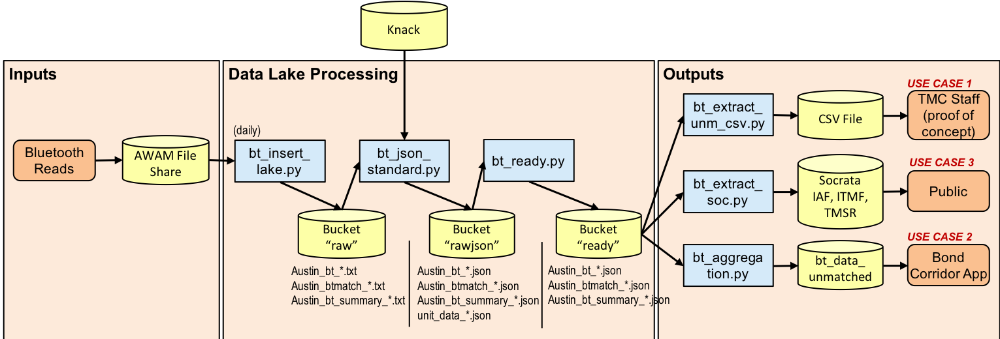

# ATD Data Lake Architecture: Bluetooth

*[(Back to Technical Architecture)](tech_architecture.md)*

Bluetooth data has three data file types: Individual Address Files (IAF), Individual Traffic Match Files (ITMF), and Traffic Match Summary Records (TMSR). Below is the system architecture for all three types of files, shown below.

| Bluetooth System Architecture <br>
|---

## IAF: Individual Address Files and Common Functionality

### Layer 1 Raw

An Individual Address File data file contains each device detected per day. Each file, named in `Austin_bt_[YYY-MM-DD].txt` format, has the following columns (with no header):

| **Position** | **Field** | **Data Type** | **Description** | **Example** |
|---|---|---|---|---|
|1|Host Read Time|Timestamp|Timestamp on the host when address of personal device was received|12/03/2010 12:00:00 AM|
|2|Field Device IP Address|String|IP address of field device|166.159.23.10|
|3|Field Device Read Time|Timestamp|Timestamp of the field device when address of personal device was received|12/03/2010 12:00:12 AM|
|4|Host Reader ID|String|The reader ID of the field device|Woodway_ChimneyRock|
|5|Personal Device Address|String|Encoded MAC address of the personal device that was read by field device|=MjU6MDA6Rjk6Mjk6NDl|

The code that processes `raw` Blutetooth IAF, as well as ITMF and TMSR is `aws_transport/bt_insert_lake.py`. That code runs on the ATD traffic control network, and looks in a mounted directory full of data files that is maintained by the Bluetooth detector system. On the host system, that share is mounted with this command (and equivalent fstab entry) (fill in username/password, and valid network address for the Samba file share):

`sudo mount -t cifs -o username=****,password=**** //00.00.00.00/awamdata /mnt/awam`

### Layer 2 JSON Data

The code in `aws_transport/bt_json_standard.py` reads the raw IAF file from the `raw` bucket, parses it, and rewrites it in a uniform JSON format to the `rawjson` bucket. A notable transformation here is a uniform time representation for the datestamps. This is a sample of a data file:

```json
{
	"header": {
		"data_type": "bluetooth",
		"file_type": "unmatched",
		"origin_filename": "Austin_bt_06-01-2019.txt",
		"target_filename": "Austin_bt_06-01-2019.json",
		"collection_date": "2019-06-01 00:00:00-05:00",
		"processing_date": "2019-06-02 04:00:33.234377-05:00"
	},
	"data": [{
			"host_timestamp": "2019-06-01 00:00:00-05:00",
			"ip_address": "172.16.26.23",
			"field_timestamp": "2019-05-31 23:59:56-05:00",
			"reader_id": "anderson_mill_bethany",
			"dev_addr": "MDY6RUY6QUY6QTA6NzM="
		}, {
			"host_timestamp": "2019-06-01 00:00:00-05:00",
			"ip_address": "172.16.183.55",
			"field_timestamp": "2019-05-31 18:04:12-05:00",
			"reader_id": "fm973_pearce",
			"dev_addr": "MUU6QjI6MjE6QjU6NDc="
		}, ...
	]
}
```

The key to CSV column mapping is:

|**Key**|**Column**
|---|---
|"host_timestamp"|1
|"ip_address"|2
|"field_timestamp"|3
|"reader_id"|4
|"dev_addr"|5

These data files are generally considered sensitive because the hashed MAC addresses provided in "dev_addr" can potentially be un-hashed and can also track repeat visitors to a sensor.

### Layer 2 Unit Data

The code that processes `raw` to `rawjson` Blutetooth IAF, as well as ITMF and TMSR, and Unit Data is `aws_transport/bt_json_standard.py`. The Unit Data, which comes from Knack, is structured as follows:

```json
{
	"header": {
		"data_type": "bt_unit_data",
		"target_filename": "unit_data_2019-06-01.json",
		"collection_date": "2019-06-01 00:00:00-05:00"
	},
	"devices": [{
			"device_type": "BLUETOOTH",
			"atd_device_id": 1,
			"device_name": "2nd_san_jacinto",
			"device_status": "TURNED_ON",
			"device_ip": "00.00.00.00",
			"ip_comm_status": "ONLINE",
			"atd_location_id": "LOC16-000750",
			"coa_intersection_id": 5157156,
			"lat": "30.2636414",
			"lon": "-97.7417908",
			"primary_st": " SAN JACINTO BLVD",
			"primary_st_segment_id": "2019056",
			"cross_st": " 2ND ST",
			"cross_st_segment_id": "2019057"
		}, ...
	]
}
```

### Layer 3 Ready Data

The `aws_transport/bt_ready.py` code reads from the `rawjson` bucket, resolves the "reader_id" to the respective entry in the Unit Data, and writes to the `ready` bucket. Effectively, all necessary Unit Data "devices" entries are added to the JSON containing "data", and linkages are created between "data"."device_id" and "devices"."device_id".

```json
{
	"header": {
		"data_type": "bluetooth",
		"file_type": "unmatched",
		"origin_filename": "Austin_bt_06-01-2019.txt",
		"target_filename": "Austin_bt_06-01-2019.json",
		"collection_date": "2019-06-01 00:00:00-05:00",
		"processing_date": "2019-06-02 06:00:05.805464-05:00"
	},
	"data": [{
			"dev_addr": "MDY6RUY6QUY6QTA6NzM=",
			"field_timestamp": "2019-05-31 23:59:56-05:00",
			"host_timestamp": "2019-06-01 00:00:00-05:00",
			"ip_address": "00.00.00.00",
			"reader_id": "anderson_mill_bethany",
			"device_id": "640bb5b19dfd5b93f8086df5c0581f76"
		}, {
			"dev_addr": "MjE6ODQ6NTU6OEE6MjU=",
			"field_timestamp": "2019-06-01 00:04:43-05:00",
			"host_timestamp": "2019-06-01 00:04:41-05:00",
			"ip_address": "00.00.00.00",
			"reader_id": "anderson_mill_bethany",
			"device_id": "640bb5b19dfd5b93f8086df5c0581f76"
		}, ...
	],
	"devices": [{
			"atd_device_id": 11,
			"atd_location_id": "LOC16-004875",
			"coa_intersection_id": "",
			"cross_st": "  ",
			"cross_st_segment_id": "",
			"device_ip": "00.00.00.00",
			"device_name": "anderson_mill_bethany",
			"device_status": "TURNED_ON",
			"device_type": "BLUETOOTH",
			"ip_comm_status": "ONLINE",
			"lat": "30.4469604",
			"lon": "-97.7977066",
			"primary_st": " ANDERSON MILL RD",
			"primary_st_segment_id": "3194314",
			"device_id": "640bb5b19dfd5b93f8086df5c0581f76"
		}, ...
	]
}
```

### Unmatched CSV Extract

A proof-of-concept was created to extract `ready` Bluetooth IAF data to CSV. The Use Case #1 was intended to demonstrate an end-to-end path for extracting Bluetooth data from the Data Lake that could be in response to a public information request, or for other purposes of data analysis. That code is `aws_transport/bt_extract_unm.py`. An example of its usage is:

`python bt_extract_unm_csv.py -s "2019-03-23 08:00:00" -e "2019-03-23 09:00:00" -f congress`

The header in the CSV output is structured as:

`time,location,lat,lon,device`

Again, the hashed MAC addresses are output. It may be better for an incrementing integer to be assigned to each new instance of a MAC address.

### Socrata

The code that loads `ready` to Socrata Blutetooth IAF ("Bluetooth Travel Sensors - Individual Address Files (IAFs)") is `aws_transport/bt_extract_soc.py`, which processes all three file types. The respective Socrata identifier is `qnpj-zrb9`.

The data stored within the table is documented on the [Socrata page](https://data.austintexas.gov/Transportation-and-Mobility/Bluetooth-Travel-Sensors-Individual-Address-Files-/qnpj-zrb9). Of particular note is:

> "Device Address": The unique address of the device that was read by the field software. For security, the source MAC address is discarded and replaced with a unique address that is reset daily.

The [JSON export](defs/socrata-bt-iaf.json) also has the column definitions, under the "meta"."view"."columns" section.

## ITMF: Individual Traffic Match Files

### Layer 1 Raw

This is an excerpt of an ITMF file, named according to the pattern, `Austin_btmatch_MM-DD-YYYY.txt`. The code `aws_transport/bt_json_standard.py` reads in the file from the AWAM share and copies it to the `raw` bucket.

```
RDM6QzI6NjE6RDA6MDM=,lamar_mlk,lamar_6th,5/31/2019 11:48:20 PM,5/31/2019 11:59:46 PM,686,5,invalid,125
REU6Q0E6MjE6QUQ6RDM=,lamar_45th,lamar_38th,5/31/2019 11:55:50 PM,5/31/2019 11:59:53 PM,243,10,invalid,125
OUM6Mjg6ODQ6MUU6ODg=,burnet_anderson,burnet_us183,5/31/2019 11:57:34 PM,5/31/2019 11:59:50 PM,136,32,valid,125
MTA6ODc6RTg6NEU6NzE=,lamar_riverside,cesar_chavez_br_reynolds,5/31/2019 11:58:34 PM,5/31/2019 11:59:51 PM,77,19,valid,125
QjI6Q0M6MEE6Mjk6QjI=,lamar_oltorf,Lamar_and_Manchca_Barton_skyway,5/31/2019 11:58:36 PM,6/1/2019 12:00:04 AM,88,32,valid,125
OTU6RUM6NTc6RTk6MEM=,lamar_51st,lamar_koenig,5/31/2019 11:58:48 PM,5/31/2019 11:59:50 PM,61,33,valid,125
MjE6OTQ6RTY6QTI6NjA=,anderson_mill_spicewood_parkway,anderson_mill_bethany,5/31/2019 11:59:10 PM,6/1/2019 12:00:00 AM,49,41,valid,125
MDM6Qjc6ODI6OTk6QTc=,guadalupe_26th,guadalupe_24th,5/31/2019 11:59:25 PM,5/31/2019 11:59:53 PM,28,19,valid,125
QjI6Q0M6MEE6Mjk6QjI=,Lamar_Blue_Bonnet,Lamar_and_Manchca_Barton_skyway,5/31/2019 11:59:31 PM,6/1/2019 12:00:04 AM,33,33,valid,125
MDA6MDA6MDA6QTA6MEU=,guadalupe_26th,guadalupe_24th,5/31/2019 11:59:31 PM,5/31/2019 11:59:55 PM,23,23,valid,125
```

At the moment, official documentation for the Post Oak Traffic AWAM Bluetooth reader is hosted at https://github.com/cityofaustin/hack-the-traffic/tree/master/docs. Each row represents a pair of readings for a particular mobile device, and has the following columns:

|**Column**|**Element Name**|**Description**
|---|---|---
|1|Device Address|Hash of the unique address of the device that was read by the field software.
|2|Origin Reader Identifier|The unique identifier assigned to origin sensor that recorded a device address match.
|3|Destination Reader Identifier|The unique identifier assigned to destination sensor that recorded a device address match.
|4|Start Time|The time the device address was recorded at the origin sensor.
|5|End Time|The time the device address was recorded at the destination sensor.
|6|Travel Time Seconds|The travel time in seconds from the origin to the destination sensor.
|7|Speed Miles Per Hour|The speed in miles per hour between the origin and the destination sensors.
|8|Match Validity|Indicates whether the sensor server classified the traffic data sample as being valid or invalid based on the filtering algorithm and minimum/maximum allowable speeds applied to the roadway segment. Values are "valid" or "invalid".
|9|Filter Identifier|The numeric code of the filtering algorithm used in the outlier filter for the roadway segment. See the host documentation section titled "Algorithm Configuration" for more information.

### Layer 2 JSON Data

The code in `aws_transport/bt_json_standard.py` reads the raw ITMF file from the `raw` bucket, parses it, and rewrites it in a uniform JSON format to the `rawjson` bucket.

```json
{
	"header": {
		"data_type": "bluetooth",
		"file_type": "matched",
		"origin_filename": "Austin_btmatch_06-01-2019.txt",
		"target_filename": "Austin_btmatch_06-01-2019.json",
		"collection_date": "2019-06-01 00:00:00-05:00",
		"processing_date": "2019-06-02 04:00:20.104616-05:00"
	},
	"data": [{
			"dev_addr": "RDM6QzI6NjE6RDA6MDM=",
			"origin_reader_id": "lamar_mlk",
			"dest_reader_id": "lamar_6th",
			"start_time": "2019-05-31 23:48:20-05:00",
			"end_time": "2019-05-31 23:59:46-05:00",
			"travel_time_secs": 686,
			"speed": 5,
			"match_validity": "invalid",
			"filter_id": 125
		}, {
			"dev_addr": "REU6Q0E6MjE6QUQ6RDM=",
			"origin_reader_id": "lamar_45th",
			"dest_reader_id": "lamar_38th",
			"start_time": "2019-05-31 23:55:50-05:00",
			"end_time": "2019-05-31 23:59:53-05:00",
			"travel_time_secs": 243,
			"speed": 10,
			"match_validity": "invalid",
			"filter_id": 125
		}, ...
	]
}
```

The key to CSV column mapping is:

|**Key**|**Column**
|---|---
|"dev_addr"|1
|"origin_reader_id"|2
|"dest_reader_id"|3
|"start_time"|4
|"end_time"|5
|"travel_time_secs"|6
|"speed"|7
|"match_validity"|8
|"filter_id"|9

### Layer 3 Ready Data

The `aws_transport/bt_ready.py` code reads from the `rawjson` bucket, resolves reader identifiers to the respective entries in the Unit Data, and writes to the `ready` bucket. In the spirit of before, linkages are created between "data"."*_device_id" and "devices"."device_id".

```json
{
	"header": {
		"data_type": "bluetooth",
		"file_type": "matched",
		"origin_filename": "Austin_btmatch_06-01-2019.txt",
		"target_filename": "Austin_btmatch_06-01-2019.json",
		"collection_date": "2019-06-01 00:00:00-05:00",
		"processing_date": "2019-06-02 06:00:29.301257-05:00"
	},
	"data": [{
			"dest_reader_id": "lamar_6th",
			"dev_addr": "RDM6QzI6NjE6RDA6MDM=",
			"end_time": "2019-05-31 23:59:46-05:00",
			"filter_id": 125,
			"match_validity": "invalid",
			"origin_reader_id": "lamar_mlk",
			"speed": 5,
			"start_time": "2019-05-31 23:48:20-05:00",
			"travel_time_secs": 686,
			"origin_device_id": "b040f50462dc83984a6868dbe831aa08",
			"dest_device_id": "545b7c56753af339ca16e388ebd1d9b2"
		}, ...
	],
	"devices": [
		{
			"atd_device_id": 72,
			"atd_location_id": "LOC16-000585",
			"coa_intersection_id": 5155322,
			"cross_st": " LAMAR BLVD",
			"cross_st_segment_id": "2019753",
			"device_ip": "172.16.132.68",
			"device_name": "lamar_6th",
			"device_status": "TURNED_ON",
			"device_type": "BLUETOOTH",
			"ip_comm_status": "ONLINE",
			"lat": "30.2715378",
			"lon": "-97.7539673",
			"primary_st": " 6TH ST",
			"primary_st_segment_id": "2019754",
			"device_id": "545b7c56753af339ca16e388ebd1d9b2"
		}, {
			"atd_device_id": 81,
			"atd_location_id": "LOC16-000545",
			"coa_intersection_id": 5155501,
			"cross_st": " MARTIN LUTHER KING JR BLVD",
			"cross_st_segment_id": "2019774",
			"device_ip": "172.16.132.72",
			"device_name": "lamar_mlk",
			"device_status": "TURNED_ON",
			"device_type": "BLUETOOTH",
			"ip_comm_status": "ONLINE",
			"lat": "30.2836018",
			"lon": "-97.7520752",
			"primary_st": " LAMAR BLVD",
			"primary_st_segment_id": "2037908",
			"device_id": "b040f50462dc83984a6868dbe831aa08"
		}, ...
	]
}
```

### Socrata

The code that loads `ready` to Socrata Blutetooth ITMF ("Bluetooth Travel Sensors - Individual Traffic Match Files (ITMF)") is `aws_transport/bt_extract_soc.py`, which processes all three file types. The respective Socrata identifier is `x44q-icha`. The integers used to identify uniquely encountered portable devices are ordered according to devices encountered within the IAF records.

The data stored within the table is documented on the [Socrata page](https://data.austintexas.gov/Transportation-and-Mobility/Bluetooth-Travel-Sensors-Individual-Traffic-Match-/x44q-icha). The [JSON export](defs/socrata-bt-itmf.json) also has the column definitions, under the "meta"."view"."columns" section.

## TMSR: Traffic Match Summary Records

### Layer 1 Raw

This is an excerpt of a TMSR file, named according to the pattern, `Austin_bt_summary_MM-DD-YYYY.txt`. The code `aws_transport/bt_json_standard.py` reads in the file from the AWAM share and copies it to the `raw` bucket.

```
51st_springdale,51st_manor,51st,Springdale,Westbound,51st,Manor,Eastbound,0.633,6/1/2019 12:00 AM,-1,-1,15,0,-1
51st_springdale,51st_us183,51st,Springdale,Eastbound,51st,US 183,Westbound,0.914,6/1/2019 12:00 AM,-1,-1,15,0,-1
51st_us183,51st_springdale,51st,US 183,Westbound,51st,Springdale,Eastbound,0.914,6/1/2019 12:00 AM,-1,-1,15,0,-1
51st_us183,51st_mueller,51st,US 183,Westbound,51st,Mueller,Eastbound,2.67,6/1/2019 12:00 AM,-1,-1,15,0,-1
51st_manor,51st_mueller,51st,Manor,Westbound,51st,Mueller,Eastbound,1.13,6/1/2019 12:00 AM,-1,-1,15,0,-1
51st_manor,51st_springdale,51st,Manor,Eastbound,51st,Springdale,Westbound,0.633,6/1/2019 12:00 AM,61,37,15,1,0
51st_mueller,51st_us183,51st,Mueller,Eastbound,51st,US 183,Westbound,2.67,6/1/2019 12:00 AM,-1,-1,15,0,-1
51st_mueller,51st_manor,51st,Mueller,Eastbound,51st,Manor,Westbound,1.13,6/1/2019 12:00 AM,-1,-1,15,0,-1
lamar_5th,guadalupe_5th,5th,Lamar,Eastbound,5th,Guadalupe,Westbound,0.499,6/1/2019 12:00 AM,-1,-1,15,0,-1
congress_5th,5th_trinity,5th,Congress,Eastbound,5th,Trinity,Westbound,0.216,6/1/2019 12:00 AM,-1,-1,15,0,-1
```

Each row represents a pair of readings for a particular mobile device, and has the following columns:

|**Column**|**Element Name**|**Description**
|---|---|---
|1|Origin Reader Identifier|The identifier assigned on the AWAM field device that uniquely identifies the origin location of the field device.
|2|Destination Reader Identifier|The identifier assigned on the AWAM field device that uniquely identifies the destination location of the field device.
|3|Origin Roadway|The name of the roadway being monitored by the AWAM system at the location of the origin field device.
|4|Origin Cross Street|The name of the closest cross street on the roadway being monitored by the origin field device.
|5|Origin Direction|The direction of roadway being monitored by the AWAM system at the location of the origin field device. For example, Northbound, Southbound, Eastbound, Westbound.
|6|Destination Roadway|The name of the roadway being monitored by the AWAM system at the location of the destination field device.
|7|Destination Cross Street|The name of the closest cross street on the roadway being monitored by the destination field device.
|8|Destination Direction|The direction of roadway being monitored by the AWAM system at the location of the destination field device. For example, Northbound, Southbound, Eastbound, Westbound.
|9|Segment Length in Miles|The length in miles of the roadway segment being monitored.
|10|Date/Time|The time that the roadway segment was updated by the AWAM host. The format of the timestamp is DD/MM/YYYY HH:MI:SS AM/PM
|11|Average Travel Time in Seconds|The average travel time in seconds for the roadway segment as calculated by the AWAM host.
|12|Average Speed in Miles Per Hour|The average speed in miles per hour for the roadway segment as calculated by the AWAM host.
|13|Summary Interval in Minutes|The interval in minutes that the averages are calculated from. For example, a value of 15 indicates the average travel times and speeds for the last 15 minutes.
|14|Number of Samples|The number of individual traffic data samples included in the travel time and speed averages.
|15|Standard Deviation|The standard deviation of the speed samples included in the summary.

### Layer 2 JSON Data

The code in `aws_transport/bt_json_standard.py` reads the raw TMSR file from the `raw` bucket, parses it, and rewrites it in a uniform JSON format to the `rawjson` bucket.

```json
{
	"header": {
		"data_type": "bluetooth",
		"file_type": "traf_match_summary",
		"origin_filename": "Austin_bt_summary_15_06-01-2019.txt",
		"target_filename": "Austin_bt_summary_15_06-01-2019.json",
		"collection_date": "2019-06-01 00:00:00-05:00",
		"processing_date": "2019-06-02 04:00:11.533292-05:00"
	},
	"data": [{
			"origin_reader_id": "51st_springdale",
			"dest_reader_id": "51st_manor",
			"origin_road": "51st",
			"origin_cross_st": "Springdale",
			"origin_dir": "Westbound",
			"dest_road": "51st",
			"dest_cross_st": "Manor",
			"dest_dir": "Eastbound",
			"seg_length": 0.633,
			"timestamp": "2019-06-01 00:00:00-05:00",
			"avg_travel_time": -1,
			"avg_speed": -1,
			"interval": 15,
			"samples": 0,
			"std_dev": -1.0
		}, ...
	]
}
```

The key to CSV column mapping is:

|**Key**|**Column**
|---|---
|"origin_reader_id"|1
|"dest_reader_id"|2
|"origin_road"|3
|"origin_cross_st"|4
|"origin_dir"|5
|"dest_road"|6
|"dest_cross_st"|7
|"dest_dir"|8
|"seg_length"|9
|"timestamp"|10
|"avg_travel_time"|11
|"avg_speed"|12
|"interval"|13
|"samples"|14
|"std_dev"|15

### Layer 3 Ready Data

The `aws_transport/bt_ready.py` code reads from the `rawjson` bucket, resolves reader identifiers to the respective entries in the Unit Data, and writes to the `ready` bucket. As before, linkages are created between "data"."device_id" and "devices"."device_id". 

```json
{
	"header": {
		"data_type": "bluetooth",
		"file_type": "traf_match_summary",
		"origin_filename": "Austin_bt_summary_15_06-01-2019.txt",
		"target_filename": "Austin_bt_summary_15_06-01-2019.json",
		"collection_date": "2019-06-01 00:00:00-05:00",
		"processing_date": "2019-06-02 06:00:34.951522-05:00"
	},
	"data": [{
			"avg_speed": -1,
			"avg_travel_time": -1,
			"dest_cross_st": "Manor",
			"dest_dir": "Eastbound",
			"dest_reader_id": "51st_manor",
			"dest_road": "51st",
			"interval": 15,
			"origin_cross_st": "Springdale",
			"origin_dir": "Westbound",
			"origin_reader_id": "51st_springdale",
			"origin_road": "51st",
			"samples": 0,
			"seg_length": 0.633,
			"std_dev": -1.0,
			"timestamp": "2019-06-01 00:00:00-05:00",
			"origin_device_id": "413a4aebac055bf58accac113cac2b3a",
			"dest_device_id": "87175d1aa8cfaa2e679e2393d908407d"
		}, ...
	],
	"devices": [{
			"atd_device_id": 138,
			"atd_location_id": "LOC16-003240",
			"coa_intersection_id": 5163482,
			"cross_st": " 51ST ST",
			"cross_st_segment_id": "2016694",
			"device_ip": "172.16.129.38",
			"device_name": "51st_manor",
			"device_status": "TURNED_ON",
			"device_type": "BLUETOOTH",
			"ip_comm_status": "ONLINE",
			"lat": "30.2981815",
			"lon": "-97.6870575",
			"primary_st": " MANOR RD",
			"primary_st_segment_id": "2016693",
			"device_id": "87175d1aa8cfaa2e679e2393d908407d"
		}, {
			"atd_device_id": 140,
			"atd_location_id": "LOC16-003185",
			"coa_intersection_id": 5164505,
			"cross_st": " 51ST ST",
			"cross_st_segment_id": "2016964",
			"device_ip": "172.16.129.37",
			"device_name": "51st_springdale",
			"device_status": "TURNED_ON",
			"device_type": "BLUETOOTH",
			"ip_comm_status": "ONLINE",
			"lat": "30.2936001",
			"lon": "-97.6778107",
			"primary_st": " SPRINGDALE RD",
			"primary_st_segment_id": "2016963",
			"device_id": "413a4aebac055bf58accac113cac2b3a"
		}, ...
	]
}
```

### Socrata

The code that loads `ready` to Socrata Blutetooth ITMF ("Bluetooth Travel Sensors - Individual Traffic Match Files (TMSR)") is `aws_transport/bt_extract_soc.py`, which processes all three file types. The respective Socrata identifier is `v7zg-5jg9`. The integers used to identify uniquely encountered portable devices are ordered according to devices encountered within the IAF records.

The data stored within the table is documented on the [Socrata page](https://data.austintexas.gov/Transportation-and-Mobility/Bluetooth-Travel-Sensors-Individual-Traffic-Match-/v7zg-5jg9). The [JSON export](defs/socrata-bt-tmsr.json) also has the column definitions, under the "meta"."view"."columns" section.
