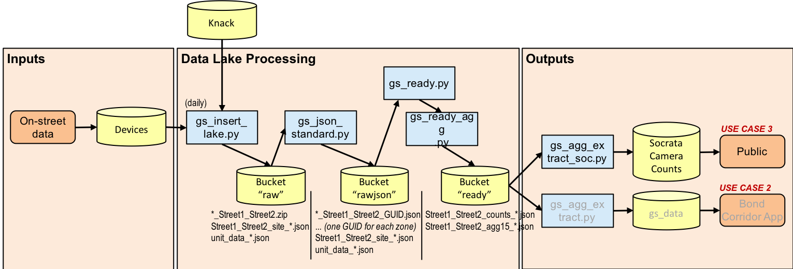
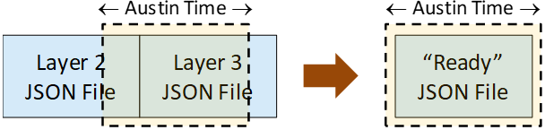

# ATD Data Lake Architecture: GRIDSMART

*[(Back to Technical Architecture)](tech_architecture.md)*

GRIDSMART cameras are fish-eye cameras with image processing capabilities. They return counts and other information. The figure below illustrates the system architecture for the GRIDSMART data.

| GRIDSMART System Architecture <br>
|---

## Layer 1 Raw

GRIDSMART counts files are comprised of a ZIPped directory structure. (The directory structure is processed in module `support.gs_investigate`) 

The structure of raw GRIDSMART counts files depend on the software version: v8 or v4. The following two tables outline the GRIDSMART raw data structure for v8 and v4. These are drawn from the [GRIDSMART API Reference](https://support.gridsmart.com/support/solutions/articles/27000026973-api-commands).

**GRIDSMART v8 Raw Data Structure**

| **Field** | **Type** | **Description** | **Example**
| --- | --- | --- | ---
| count_version | integer | GRIDSMART camera software version | 8
| site_version | text | | 23
| timestamp | timestamp | UTC timestamp of record in HHMMSS.f format | 105452.4
| utc_offset | numeric | Local timezone offset from UTC | -360
| turn | text | Turn movement of vehicle (S, R, L, U) | L
| vehicle_length | numeric | Vehicle length in ft. | 11
| speed | numeric | Speed at which the vehicle was detected | 13
| light_state | text | Light state when the vehicle was detected (R for red, Y for yellow, G for green) | R
| seconds_in_zone | numeric | Number of seconds the vehicle was detected within the zone | 2
| vehicles_in_zone | numeric | Number of vehicles in the zone when vehicle was detected | 2
| light_state_sec | numeric | Number of seconds the light state has been occurring when vehicle was detected | 2
| sec_since_green | numeric | Seconds since the last green light state when vehicle was detected | 0
| zone_freeflow_speed | numeric | Free flow speed of zone where vehicle was detected | 22
| zone_freeflow_speed_cal | numeric | Calibrated free flow speed of zone where vehicle was detected | 23

---

**GRIDSMART v4 Raw Data Structure**

| **Field** | **Type** | **Description** |
| --- | --- | --- |
| count_version | integer | GRIDSMART camera software version
| site_version | text |
| timestamp | timestamp | UTC timestamp of record in local time
| internal_veh_id | numeric | Local timezone offset from UTC
| internal_veh_type | text | Turn movement of vehicle (S, R, L, U)
| vehicle_length | numeric | Vehicle length in ft.
| speed | numeric | Speed at which the vehicle was detected
| turn | text | Turn movement of vehicle (S, R, L, U)
| allowable_turns | text | Allowed turn movements of zone
| seconds_in_zone | numeric | Number of seconds the vehicle was detected within the zone
| seconds_since_last_exit | numeric |
| queue_length | numeric | Number of vehicles in queue
| light_state_on_exit | text | Light state when the vehicle left the zone (R for red, Y for yellow, G for green)
| sec_since_green | numeric | Seconds since the last green light state when vehicle was detected
| internal_frame_count | numeric |
| day_night | text | Whether record occured at night or during the day

The API function for calling into GRIDSMART is represented in the following HTTP request, replacing the IP address with a valid one, and is automated through the `collecting.gs.log_reader` module, called by `support/last_upd_gs`:

```
http://00.00.00.00:8902/api/counts/bydate/2018-03-21
```

The software that coordinates the efforts of identifying the active GRIDSMART devices, reading their status, and extracting counts data is `aws_transport/gs_insert_lake.py`. When it is run, `support.knack_access.get_device_locations()` queries Knack for unit data. Then, each of those devices are accessed in `collecting.gs.log_reader` regardless of whether Knack has labeled them as communicating or not. (Knack seems to only label a couple devices as functional, whereas attempts to query others succeeds quite often).

Counts data returned from each GRIDSMART device is stored in a .ZIP file and named `YYYY-MM-DD_street1_street2.zip`.

Because the `gs_insert_lake.py` code is meant to run on the City of Austin traffic control network, this is the only opportunity to query GRIDSMART devices for other information. Each GRIDSMART device is queried for its site information, which is stored as a "Site File": `street1_street2_site_YYYY-MM-DD.json`. The file stored in the Data Lake is a direct copy of what is returned from the device. Also, because the site file is read for the day that the code is run regardless of how far into the past counts data are retrieved, Site Files are only stored for the day of retrieval. (Bear in mind, however, that historic site information can be accessed from the devices via the "history" API key. *TODO: Look into this.*). Along with this, the list of dates that contain valid data is queried so that the software then knows to attempt to request data. The timestamp is also queried here.

Inside the site file, the keys of consequence (and a few others) are as shown below. Many others that aren't as relevant have been omitted in this documentation:

```json
{
	"header": {
		"data_type": "gs_site",
		"target_filename": "Burnet_Richcreek_site_2019-06-02.json",
		"collection_date": "2019-06-02 00:00:00-05:00",
		"device_net_addr": "172.16.42.27"
	},
	"site": {
        //...
		"CameraDevices": [{
				"Fisheye": {
                    //...
					"CameraMasks": {
                        //...
						"ZoneMasks": [{
								"Vehicle": {
									"ApproachType": "Northbound",
									"NumberOfLanes": 2,
									"PermissivePhases": [],
									"SpeedScale": 1,
									"TurnType": "Straight",
									"ExpectedFreeFlowSpeed": 40,
									"Alerts": [],
									"DelaySeconds": 0,
									"DelaySecondsPrecise": 0,
                                    "ExtensionSeconds": 0,
                                    //...
									"IncludeInData": true,
									"Latching": false,
									"MaxRecall": false,
									"Name": "",
									"Outputs": [{
											"Pin": 2,
											"Interface": 0,
											"MinimumOccupancy": 1
										}
									], //...
									"ProtectedPhases": [2],
									"VisibilityDetectionEnabled": true,
									"Id": "2c6dff02cb0c4da0adc528dd1946df40", //...
								}
                            }, //...
						]
					}, //...
					"MACAddress": "00:30:53:26:e6:e1",
					"Name": "Burnet & Richcreek"
				}
			}
		],
		"Id": "2017a9668fda4ce497dd62ef52a560c3",
		"Location": {
			"City": "Austin",
			"Country": "USA",
			"County": "Travis",
			"Latitude": 30.35,
			"Longitude": -97.73,
			"MetricUnits": false,
			"PostalCode": "78757",
			"RightSideDriving": true,
			"State": "TX",
			"Street1": "Burnet",
			"Street2": "Richcreek"
		}, //...
	},
	"datetime": {
		"DateTime": "6/3/2019 2:32:13 AM",
		"TimeZoneId": "(UTC-05:00) Eastern Time (US & Canada)",
		"HostTimeUTC": "06/03/2019 06:34:06 AM"
	},
	"hardware_info": {
		"BoxSerialNumber": "GS2-3826",
		"HardwareId": "00E04B6064D2",
		"HardwareVersion": "GS2"
	}
}
```

There is also a unit data file containing the information from Knack, called `unit_data_YYYY-MM-DD.json`. As with site files, unit data files are only stored on the days of retrieval. This is an excerpt of unit data:

```json
{
	"header": {
		"data_type": "gs_unit_data",
		"target_filename": "unit_data_2019-06-02.json",
		"collection_date": "2019-06-02 00:00:00-05:00"
	},
	"devices": [{
			"device_type": "GRIDSMART",
			"atd_device_id": 6160,
			"device_ip": "00.00.00.00",
			"device_status": "",
			"ip_comm_status": "OFFLINE",
			"atd_location_id": "LOC16-000935",
			"coa_intersection_id": 5151323,
			"lat": "30.2282581",
			"lon": "-97.7894058",
			"primary_st": " MANCHACA RD",
			"primary_st_segment_id": "2024176",
			"cross_st": " REDD ST",
			"cross_st_segment_id": "2024177"
        }, //...
	]
}
```

## Layer 2 JSON Data

This is a sample of a GRIDSMART JSON file, with one created per `"site"."CameraDevices"[0]."Fisheye"."CameraMasks"."ZoneMasks"."Vehicle"` as depicted in the site file.

```json
{
	"header": {
		"data_type": "gridsmart",
		"zip_name": "2019-06-01_Burnet_Richcreek.zip",
		"origin_filename": "2c6dff02-cb0c-4da0-adc5-28dd1946df40.csv",
		"target_filename": "2019-06-01_Burnet_Richcreek_2c6dff02-cb0c-4da0-adc5-28dd1946df40.json",
		"collection_date": "2019-06-01 00:00:00-05:00",
		"processing_date": "2019-06-02 08:00:14.469463-05:00",
		"version": 8,
		"guid": "2c6dff02-cb0c-4da0-adc5-28dd1946df40"
	},
	"data": [{
			"count_version": 8,
			"site_version": 23,
			"timestamp": 18.6,
			"utc_offset": -240,
			"turn": "S",
			"vehicle_length": 10,
			"speed": 42,
			"light_state": "G",
			"seconds_in_zone": 2.0,
			"vehicles_in_zone": 1,
			"light_state_sec": 126.08,
			"sec_since_green": 0.0,
			"zone_freeflow_speed": 42,
			"zone_freeflow_speed_cal": 39,
			"timestamp_adj": "2019-05-31 22:02:11.600000-05:00"
		}, //...
	]
}
```

GRIDSMART JSON files, formatted as `YYYY-MM-DD_street1_street2_GUID.json`, are composed of two objects: a header and data object. The header contains metadata information such as the `"data_type,"` the `"zip_name"` (where the data comes from), and the `"origin_filename"` (the GUID file within the extracted ZIP folder). `"target_filename"` is the JSON Layer 2 data file name composed of a combination the ZIP name and GUID filename. `"collection_date"` is the date when the data was retrieved from the camera. `"processing_date"` is the timestamp of aggregation. `"version"` stands for the software version of the camera and `"guid"` represents the identifier of the filename.

The `"data"` object includes the raw data in a JSON serialized format with the same fields plus and additional `"timestamp_adj"` variable that holds the adjusted timestamp. Challenges encountered concerning time representation within GRIDSMART data include:

* different API versions assume different rules for time zones
* Daylight Saving Time was ignored
* internal clocks were sometimes off by ~1/2 hour, presumably because of clock drift over time.

| GRIDSMART time adjustment <br><br> |
|---|

Until July 10, 2019, the GRIDSMART devices were not configured to retrieve central time and corresponding daylight saving changes from a central NTP time server. To compensate, code was written to compare the time reported on each GRIDSMART device with the (assumed accurate) time reported on the server that retrieved the data from each device. The differences were logged in the site files (under the `"datetime"` key) and then used to offset the timestamps to a corrected state. While the same correction code still runs for new data, it is anticipated that the offset for devices that correctly utilize NTP server centralized time will have a very small offset. The idea is to have the `"ready"` JSON counts file pertain only to the day that it is filed  within the Data Lake.

Because they were retrieved from devices at Layer 1 `raw`, the site data and unit data files are copied from Layer 1 `raw` to Layer 2 `rawjson`.

## Layer 3 Ready Counts Data

The `ready` layer encompasses two types of files: counts and aggregated counts. Both of these files have merged unit, site, and raw data information into a single file. The `aws_transport/gs_ready.py` reads through each GUID zone file from the `rawjson` bucket, appends  data together from all zones, adds in the site information, and produces a new file for the `ready` bucket named `street1_street2_counts_YYYY-MM-DD.json`. Inside its `"counts"` section, there is one data entry per vehicle detected. That counts file looks like this:

```json
{
	"header": {
		"data_type": "gridsmart",
		"zip_name": "2019-06-01_Burnet_Richcreek.zip",
		"collection_date": "2019-06-01 00:00:00-05:00",
		"processing_date": "2019-06-03 17:20:40.267065-05:00",
		"version": 8
	},
	"counts": [{
			"count_version": 8,
			"site_version": 23,
			"timestamp": 15820.0,
			"utc_offset": -240,
			"turn": "S",
			"vehicle_length": 14,
			"speed": 26,
			"light_state": "G",
			"seconds_in_zone": 0.4,
			"vehicles_in_zone": 0,
			"light_state_sec": 466.02,
			"sec_since_green": 0.0,
			"zone_freeflow_speed": 35,
			"zone_freeflow_speed_cal": 32,
			"timestamp_adj": "2019-06-01 00:00:13-05:00",
			"zone": "ae256bab37dc499e88829cfd5a0fde6b"
		}, //...
	],
	"site": {
		"header": {
			"data_type": "gs_site",
			"target_filename": "Burnet_Richcreek_site_2019-06-01.json",
			"collection_date": "2019-06-01 00:00:00-05:00",
			"device_net_addr": "172.16.42.27"
		},
		"site": { //...
			"CameraDevices": [{
					"Fisheye": {
						"CameraMasks": {
							"ZoneMasks": [{
                                    "Vehicle": { //...
                                    }
								}, {
									"Vehicle": {
										"ApproachType": "Southbound",
										"NumberOfLanes": 2,
										"PermissivePhases": [],
										"SpeedScale": 1,
										"TurnType": "Straight",
										"ExpectedFreeFlowSpeed": 40,
										"Alerts": [],
										"DelaySeconds": 0,
										"DelaySecondsPrecise": 0,
										"ExtensionSeconds": 0,
										"FlowVector": { //...
										},
										"IncludeInData": true,
										"Latching": false,
										"MaxRecall": false,
										"Name": "",
										"Outputs": [{ //...
											}
										],
										"OutputBIUs": [],
										"OutputSIUs": [],
										"OutputPins": [6],
										"ProtectedPhases": [6],
										"VisibilityDetectionEnabled": true,
										"Id": "ae256bab37dc499e88829cfd5a0fde6b",
                                        "Polygon": [ //...
                                        ]
									}
								}, //...
                            ]
						},
						"CompassHeading": 77,
						"ExtrinsicCalibration": {
							"HeightFeet": 26
						},
						"IntrinsicCalibration": { //...
						},
						"IsConfigured": true,
						"MACAddress": "00:30:53:26:e6:e1",
						"Make": "Basler",
						"Name": "Burnet & Richcreek"
					}
				}
			],
			"ContactGroups": [],
			"Id": "2017a9668fda4ce497dd62ef52a560c3",
			"Location": {
				"City": "Austin",
				"Country": "USA",
				"County": "Travis",
				"Latitude": 30.35,
				"Longitude": -97.73,
				"MetricUnits": false,
				"PostalCode": "78757",
				"RightSideDriving": true,
				"State": "TX",
				"Street1": "Burnet",
				"Street2": "Richcreek"
			},
			"ModelVersion": 4,
			"Name": "Factory Default",
			"Settings": {
				"ActiveOnGreenDuringAllCalls": false,
				"AllCallsOutputPin": 0,
				"Cabinet": {
					"TS1": {}
				},
				"ControlMode": "Full",
				"MinutesToHoldStationaryVehicle": 0,
				"SCATS": false
			}
		},
		"datetime": {
			"DateTime": "6/2/2019 2:31:55 AM",
			"TimeZoneId": "(UTC-05:00) Eastern Time (US & Canada)",
			"HostTimeUTC": "06/02/2019 06:33:48 AM"
		},
		"hardware_info": {
			"BoxSerialNumber": "GS2-3826",
			"HardwareId": "00E04B6064D2",
			"HardwareVersion": "GS2"
		}
	},
	"device": {
		"device_type": "GRIDSMART",
		"atd_device_id": 6548,
		"device_ip": "172.16.42.27",
		"device_status": "OK",
		"ip_comm_status": "OFFLINE",
		"atd_location_id": "LOC16-000390",
		"coa_intersection_id": 5157931,
		"lat": "30.3505726",
		"lon": "-97.7343369",
		"primary_st": " BURNET RD",
		"primary_st_segment_id": "2011236",
		"cross_st": " RICHCREEK RD",
		"cross_st_segment_id": "2011237",
		"reversed": false
	}
}
```

## Layer 3 Ready Aggregation Data

The aggregated data files contain aggregate counts to fifteen minutes. The `aws_transport/gs_ready_agg.py` script reads in the counts file from the `ready` bucket, performs the aggregation, and writes to a new file in the `ready` bucket named `street1_street2_agg15_YYYY-MM-DD.json`. In creating aggregations, the records within the counts file that share the same approach, turning movement, and vehicle length classification are grouped in those fifteen-minute intervals. This is an excerpt from the aggregation file; the `"site"` and `"device"` sections are the same as those in the counts file:

```json
{
	"header": {
		"data_type": "gridsmart",
		"zip_name": "2019-06-01_Burnet_Richcreek.zip",
		"collection_date": "2019-06-01 00:00:00-05:00",
		"processing_date": "2019-06-03 17:55:45.297516-05:00",
		"version": 8,
		"agg_interval_sec": 900
	},
	"data": [{
			"timestamp": "2019-06-01 00:00:00-05:00",
			"zone_approach": "Eastbound",
			"turn": "S",
			"heavy_vehicle": 1,
			"volume": 1,
			"speed_avg": 7.0,
			"speed_std": 0.0,
			"seconds_in_zone_avg": 67.5,
			"seconds_in_zone_std": 0.0
		}, {
			"timestamp": "2019-06-01 00:00:00-05:00",
			"zone_approach": "Northbound",
			"turn": "L",
			"heavy_vehicle": 1,
			"volume": 5,
			"speed_avg": 0.0,
			"speed_std": 0.0,
			"seconds_in_zone_avg": 1.3,
			"seconds_in_zone_std": 1.084
		}, //...
	],
	"site": { //...
	},
	"device": { //...
	}
}
```

Vehicle length is classified according to the counts data `"vehicle_length"` value; if the vehicle is greater than or equal to seventeen feet, then `"heavy_vehicle"` is True. This is currently hard-coded in `aws_transport/gs_ready_agg.py` in the `main()` function but is planned to be cleaned up.

There are opportunities to  do more calculations within the aggregation. For example, calculations can be done with queue length, vehicles counted at red or greeen lights, and right turn on red.

The average speed measure must still be investigated. There is a difference in how average speed is reported in v4 counts files versus v8 files. The v8 speeds go through an improved "normalization" process. Documentation from GRIDSMART states that speed measures are calibrated over the course of fourteen days. *TODO: Verify for v8 Counts that speed comes from the `"zone_freeflow_speed_cal"` column.*

## Socrata

The `aws_transport/gs_agg_extract_soc.py` script reads aggregation files from the `ready` layer and writes them to Socrata, under the ["Camera Traffic Counts"](https://data.austintexas.gov/Transportation-and-Mobility/Camera-Traffic-Counts/sh59-i6y9) page. The identifier in Socrata for this is `"sh59-i6y9"`. The columns provided for the dataset are very similar to those in the ["Radar Traffic Counts"](https://data.austintexas.gov/Transportation-and-Mobility/Radar-Traffic-Counts/i626-g7ub) dataset. The intersection name as given by Knack is provided in the "Intersection Name" column, but the "ATD Device ID" is also given and can be looked up in the ["Traffic Detectors"](https://data.austintexas.gov/Transportation-and-Mobility/Traffic-Detectors/qpuw-8eeb) dataset.

The column definitions are found within the `"meta"."view"."columns"` section of the [Socrata JSON export](defs/socrata-gs.json).
