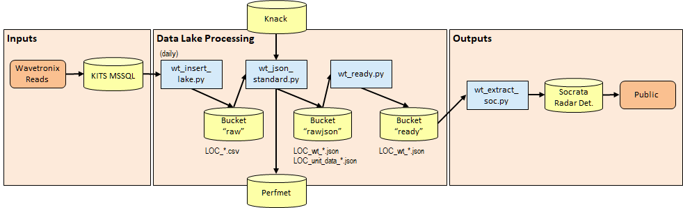

# ATD Data Lake Architecture: Wavetronix

*[(Back to Technical Architecture)](tech_architecture.md)*

Wavetronix data is composed of radar vehicle counts mid-block. The following figure overviews the system architecture for this data type:

| Wavetronix System Architecture <br>
|---

## Layer 1 Raw Data

To get started, Wavetronix data is read from a MS SQL Server database table that's used by the City of Austin KITS traffic signal centrals software. Two tables within that database receive live updates of Wavetronix detector data from processes that had been designed by consultants. Inside the `wt_insert_lake.py` script, the information read out of the database is directly written nightly to a CSV file that looks like this:

```
detID,intID,curDateTime,intName,detName,volume,occupancy,speed,status,uploadSuccess,detCountComparison,dailyCumulative
2,1,2020-09-13 00:00:00,LAMARMANCHACA,NB_in,19,0,34,Working,100,1,19
1,1,2020-09-13 00:00:00,LAMARMANCHACA,NB_out,17,0,31,Working,100,0,17
3,1,2020-09-13 00:00:00,LAMARMANCHACA,SB_in,38,2,36,Working,100,2,38
4,1,2020-09-13 00:00:00,LAMARMANCHACA,SB_out,27,1,34,Working,100,3,27
...
```

To the author's knowledge, no clear documentaion exists on the columns defined within the database; however, the important ones such as volume and speed can be discerned. The `intID` column does eventually map to the `kits_id` value that is found in the Unit Data written in the Layer 2 stage.

## Layer 2 JSON Data
This is handled in the `wt_json_standard.py` script. In addition to Unit Data being read from Knack and a Unit Data File being written with the date of processing (`LOC_wt_YYYY-MM-DD_unit_data.json`), the JSON transformation the above data is written in this format, along with timestamps qualified with the time zone:

```json
{
	"header": {
		"data_type": "wavetronix",
		"origin_filename": "Austin_2020-09-13.csv",
		"target_filename": "Austin_2020-09-13.json",
		"collection_date": "2020-09-13 00:00:00-05:00",
		"processing_date": "2020-09-14 17:21:11.551324-05:00"
	},
	"data": [{
			"detID": 2,
			"intID": 1,
			"curDateTime": "2020-09-13 00:00:00-05:00",
			"intName": "LAMARMANCHACA",
			"detName": "NB_in",
			"volume": 19,
			"occupancy": 0,
			"speed": 34,
			"status": "Working",
			"uploadSuccess": 100,
			"detCountComparison": 1,
			"dailyCumulative": 19
		}, //...
	]
}
```

It is in this processing step that "perfmet" performance metrics are generated, which consists of total vehicle counts for each device.

## Layer 3 JSON Ready Data
In this stage coordinated by the `wt_ready.py` script, device data from the closest future Unit Dat file is combined with the JSON data to result in a similarly formatted file:

```json
{
	"header": {
		"data_type": "wavetronix",
		"origin_filename": "Austin_2020-09-13.csv",
		"target_filename": "Austin_2020-09-13.json",
		"collection_date": "2020-09-13 00:00:00-05:00",
		"processing_date": "2020-09-16 09:40:50.459962-05:00"
	},
	"data": [{
			"detID": 1,
			"intID": 1,
			"curDateTime": "2020-09-13 00:00:00-05:00",
			"intName": "LAMARMANCHACA",
			"detName": "NB_out",
			"volume": 17,
			"occupancy": 0,
			"speed": 31,
			"status": "Working",
			"uploadSuccess": 100,
			"detCountComparison": 0,
			"dailyCumulative": 17,
			"device_id": "ade08f890a9eb449b47641fe62143831"
		}, //...
	],
	"devices": [{
			"device_type": "RADAR",
			"atd_device_id": 160,
			"device_name": null,
			"device_status": "TURNED_ON",
			"device_ip": "****",
			"ip_comm_status": "ONLINE",
			"atd_location_id": "LOC17-010435",
			"coa_intersection_id": 5152101,
			"lat": "30.243875",
			"lon": "-97.781705",
			"primary_st": "LAMAR BLVD",
			"primary_st_segment_id": 2023812,
			"cross_st": "MANCHACA RD",
			"cross_st_segment_id": 2023827,
			"kits_id": 1,
			"device_id": "ade08f890a9eb449b47641fe62143831"
		}, //...
	]
}
```

## Socrata Publishing
Finally, the `wt_extract_soc.py` script publishes out data to Socrata under the "i626-g7ub" page according to the format outlined at https://data.austintexas.gov/Transportation-and-Mobility/Radar-Traffic-Counts/i626-g7ub