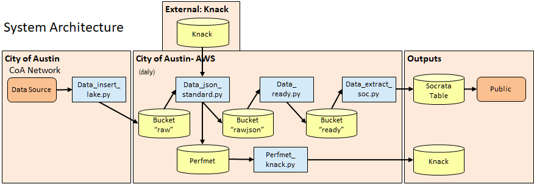

# ATD Data Lake Architecture: Intro and Functionlity

*[(Back to Docs Catalog)](index.md)*

There is a growing need for cities to make data generated within city limits publicly accessible for meaningful data insights. In light of this need, the data integration initiative for the Austin Transportation Department (ATD) aims to store and archive the vast amount of information gathered by sensors throughout Austin's city limits.

Austin's Data Lake approach to sustainably store and archive sensor data preserves the integrity of the original data and leverages low-cost cloud storage. By preserving the integrity of sensor data, ATD retains the ability to re-process the data at a later time for novel analyses that have yet to be developed while keeping in mind city resources.

ATD's Data Lake is a layered system where raw data is stored and processed intermediaries as stored as JSON files. The layered system leverages the significantly lower cost of cloud storage over computing power  where the processed layers can be batched or nightly processed, depending on City resources. Further, to allow flexibility in meeting various data needs, end-user products (whether it be a database, or a CSV file dump) depend on use-cases. We delve into the components of the Data Lake architecture to show how it is intended to achive its objectives.

## Overall Structure

The ATD Data Lake Architecture has the following essential components:
1. A PostgREST Catalog 
2. AWS Raw bucket ("raw")
3. AWS Canonical Raw data bucket ("rawjson")
4. AWS Processed data bucket ("ready")

Together, the above components preserve the integrity of the sensor data, facilitate stop-and-go processing as well as promote ease of data exchange.

## Digging Deeper

The PostgREST catalog contains pointers to the data files with collection and processing dates and other metadata. By keeping track of each processing step for each data file, the catalog allows flexibility in stop-and go processing. The AWS Raw Bucket has a year/month/day/data source file structure that preserves the integrity of the original data. Processes within the City infrastructure reads data from sources and uploads them to AWS Raw Bucket and catalogs them. 

Similarly, the AWS Canonical Raw Bucket retains the integrity of raw data while making it accessible for further processing through unpacking files and canonizing to JSON. The idea is that if a mistake is made, processes such as unpacking files do not have to be repeated. To get data into the Canonical Bucket, an algorithm gathers the data files needing to be processed, fetches them from the first bucket and subsequently canonizes them to a standadized JSON format. Standardization is a good common practice for data integration efforts and a JSON specification provides a "portable representation of structured data" [1] and is less verbose than, for example, XML.

The Canonical Raw Bucket file structure follows that of the Raw Bucket, plus additional files that archive and catalog sensor information. A process within the cloud framework reads from the City infrastructure to attain the sensor information to then merge with the actual data. 

Lastly, a process within the cloud framework gathers data files from Bucket 2, then processes, catalogues and uploads the data into the third AWS bucket. However, in processing data files from the second bucket to the third, the data is aggregated and merged with sensor information. This way, all data files within the AWS Processed Data Bucket are largely self-contained. As such, further temporal or spatial aggregations are easily computed and custom end-user products can be delivered. Again, JSON allows ease of data exchange through APIs.

## Challenges and Design Criteria

The design of the Data Lake incorporates considerations on other designs learned about in other cities' open data efforts. While evaluating such designs, realizations guided the multi-layered design that had been implemented for this project. That is:

* Cloud services have a number of features that are proprietary and lead to "vendor lock-in". We want to minimize the use of vendor-specific APIs.
* Cloud services bill for various resources. We want to use resources in the most cost-effective way. In comparing with cloud offerings, the flat-file storage capabilities of S3 was found to be far more cost-effective than relational or noSQL database offerings.
  * The cloud service landscape changes, so costs should be surveyed again, near a yearly basis.
  * There is a need to have a fine-grained ability to measure the costs on specific resources.
* Live data updates are not a high priority currently. An end-of-day batch processing model was targeted.
  * The code that performs the data transformations needs to be as simple as possible. Ongoing efforts for FY20 are intended to improve upon this by streamlining code, improving testability, and consolidating common functionlitiy into libraries.
  * The code can be structured to better facilitate line-by-line live updates.
* Different buckets offer different security and cost mechanisms. Sensitive data can be anonymized in downstream processing. Other parties may be given access to specific resources in such a way that the cost of data extraction may be passed on to them.

The following summarizes findings emerging from conference calls with data practitioners working with Portland, OR, and Denver, CO data:

* There is a fundamental difference between designing an architecture for archiving historical data vs. streaming sources of data (e.g. Portland's approach).
* Very clear use cases can greatly help with communicating ideas and working toward goals.
* Positive aspects of Austin's design is open source and the ability to process at specific, predermined times over desired time ranges.
* Disadvantages include lack of streaming ability and the heavy dependence on custom coding.

## Dockless Mobility

In considering future data analysis capabilities, this project looked at the possibility of working with dockless mobility (e.g. scooter) data. Current major restrictions are:

* GPS coordinates are truncated to .001 (~100 x 100m block) 
* Trip trajectories are not available

The restrictions are largely imposed to protect personal identifiable information (PII). Data sharing agreements would need to be put into place in order to analyze data that offers more details. Questions were asked about what could be done if access to detailed data were available:

* What is the relationship between micro-mobility and transit? Do people choose to use scooters instead of transit? Or do scooters facilitate getting to/going from transit stops?
* What does a "tourist" trip trajectory look like vs. a "commuter" trip?

Efforts for establishing a data sharing agreement with a dockless mobility provider are currently being pursued and evaluated.

## Citations
[1] https://www.ietf.org/rfc/rfc4627.txt
