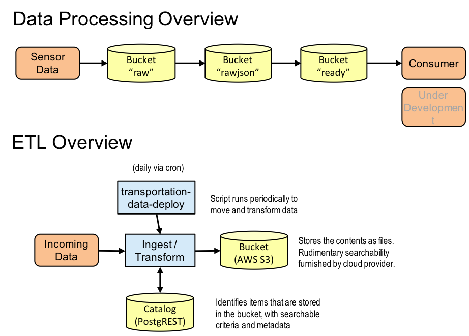
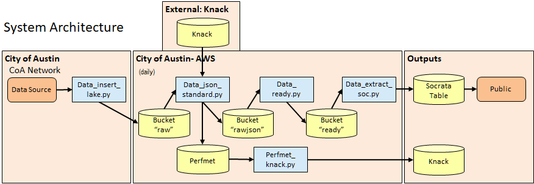
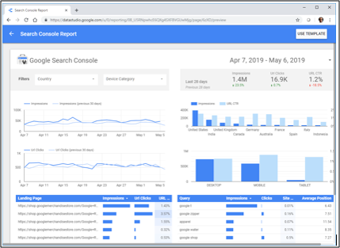

# ATD Data Lake Architecture: Technical  <!-- omit in toc -->

*[(Back to Docs Catalog)](index.md)*

This is the architecture document that serves as a technical overview of work performed.

## Table of Contents <!-- omit in toc -->

- [Use Cases](#use-cases)
- [Theory of Operation](#theory-of-operation)
- [Source Code](#source-code)
- [Data Source Specifics](#data-source-specifics)
  - [Bluetooth](#bluetooth)
  - [GRIDSMRT](#gridsmrt)
  - [Wavetronix](#wavetronix)
- [Data Lake Catalog](#data-lake-catalog)
- [Other Coding Challenges](#other-coding-challenges)
  - [System Time](#system-time)
  - [Street Naming](#street-naming)
  - [Cloud Service Visualizations](#cloud-service-visualizations)

## Use Cases

To allow flexibility in meeting various data needs, end-user products (whether a database or a CSV file dump) depend on specific use-cases, such as:

* **Case 1: Bluetooth public information request (PIR)**
  * Goal: Provide 2 years of raw Bluetooth data
    * Example: A city official receives a PIR for a couple of years’ worth of data, queries the data lake and supplies a CSV file to the requester.
  * Audience: city staff responding to request
  * Significance: Ease of ability to provide requested data
  * Outcomes:
    * The city staff is able to run a query and provide a CSV file.
    * ATD saves resources (time and effort) in working with historic data.

* **Case 2: CoA Bond Corridors database/research partner**
  * Goal: Populate CTR Bond Corridors database that feeds into app
    * Example: Bluetooth, Wavetronix (radar), and GRIDSMART data are obtained from the Data Lake, processed, and updated nightly to feed app analyses
  * Audience: Research Institution – UT CTR
  * Significance: Ease of ability to support research institutions initiatives
  * Outcomes:
    * CTR hosts its own data for research purposes with daily updates
    * ATD saves resources (time and effort) when providing data to partners

* **Case 3: Populate Socrata**
  * Goal: Populate Austin’s Socrata public data portal
    * Example: As part of a civic hacking challenge, a participant would like to visualize travel times throughout the day for N. Lamar Boulevard to assess the environmental effects of congestion
  * Audience: Public using the web data portal
  * Significance: Ease of ability to publicly share data
  * Outcomes:
    * Daily updates are automatically fed into the publicly accessible data portal
    * ATD saves resources (time and effort) when uploading and maintaining public datasets 

## Theory of Operation

To sustainably store and archive sensor data, Austin's Data Lake approach is a layered system where raw data is stored and processed intermediaries are rendered as JSON files. The layered system leverages the significantly lower cost of cloud storage over computing power where the processed layers can be batched or processed nightly, depending on City resources.

There are two key considerations in the development of the architecture: the various stages for data processing and the ETL (extract, load, and transform) processes that make it happen. The following figure overviews the data stages and ETL processes.

| System Overview <br>
|---

As mentioned in the introduction document, the ATD Data Lake Architecture has the following essential components:

1. A PostgREST catalog
2. AWS 'raw' data bucket (Layer 1)
3. AWS canonical 'rawjson' data bucket (Layer 2)
4. AWS processed 'ready' data bucket (Layer 3)

Together, the above components preserve the integrity of the sensor data, facilitate stop-and-go processing as well as promote ease of data exchange. The figure below outlines the overall architecture of the ATD Data Lake.

| System Architecture <br>
|---

A PostgREST database acts as an inventory. It contains pointers to the data files with collection and processing dates and other metadata.  A process within the City infrastructure reads files from the source, catalogs them, and uploads to the cloud storage resource (which is currently AWS S3). The bucket has a "year/month/day/data source" file structure.

Within the AWS S3 are three layers: `raw`, `raw-json` and `ready`. The purpose of the `raw` layer is to fetch data from various sources and place untouched files into the Data Lake. It preserves the integrity of the original data and leverages low-cost cloud storage. Because the Data Lake is in its early stages of development, maintaining raw data integrity allows for later flexibility in processing. For example, if a different way of standardizing the data for a more complex data integration effort is established, the raw data can still be accessed. This also removes the burden of long-term storage from the peripheral sensors.

In the `raw-json` layer, the data are accessible for further processing through unzipping files and canonizing to JSON. The idea is that if a mistake is made in later data processing stages, steps such as unzipping files do not have to be repeated. To place data into the bucket, an algorithm gathers the data files needing to be processed from the inventory, fetches them from the first layer, and subsequently canonicalizes them to a standardized JSON format.

The `ready` layer contains merges city-maintained sensor location information (currently located in Knack) to actual data so that a single file or set of files are self-contained. The theory is that no other sources or files are necessary to make sense of the data within the file.

## Source Code

The code that had been written to perform the data processing activities shown below is currently stored in the `nmc/coa_dev` repository that's located on a private, internal GitLab server hosted by CTR. The code is for Python 3. This and its dependencies are intended to be migrated to the [`cityofaustin/atd-data-lake` repository](https://github.com/cityofaustin/atd-data-lake) hosted on GitHub.

Entry points referenced in this document abide by the `cityofaustin/atd-data-deploy` interface, as found in [GitHub](https://github.com/cityofaustin/atd-data-deploy), which provides a "cron"-driven method for launching Dockerized ETL activities that also log progress to a database.

Within the `nmc/coa_dev` source code tree, command-line entry points are currently in the `aws_transport` package. The special `_setpath.py` script allows modules within `aws_transport` to be run from that directory. There are a number of system-specific configurations that are globally accessible from within the `aws_transport.support.config` package. This contains further mechanisms for accessing the `aws_transport.support.config_secret` package, which contains API keys and passwords that are not to be publicly shared. These help with reaching PostgREST, Knack, Socrata, and AWS. Future efforts may involve looking at an online escrow agent that can manage these items, rather than a package.

## Data Source Specifics

### Bluetooth

[Go to further information on Bluetooth.](datasrc_bt.md)

### GRIDSMRT

[Go to further information on GRIDSMART.](datasrc_gs.md)

### Wavetronix

[Go to further information on Wavetronix.](datasrc_wt.md)

## Data Lake Catalog

The Data Lake catalog, accessible through a PostgREST interface, provides a queryable record of all entries that have been added to the Data Lake. Every time a new file is written to a layer of the Data Lake, a new entry is created for the catalog. This is the catalog's PostgreSQL table definition:

```
 Table "api.data_lake_catalog"
     Column      |           Type           | Collation | Nullable |            Default
-----------------+--------------------------+-----------+----------+--------------------------------
 id              | integer                  |           | not null | api.data_lake_catalog_id_seq
 repository      | text                     |           | not null |
 data_type       | text                     |           | not null |
 id_base         | text                     |           | not null |
 id_ext          | text                     |           | not null |
 pointer         | text                     |           | not null |
 collection_date | timestamp with time zone |           | not null |
 processing_date | timestamp with time zone |           |          |
 metadata        | jsonb                    |           |          |
Indexes:
    "data_lake_catalog_pkey" PRIMARY KEY, btree (collection_date, repository, data_type, id_base, id_ext)
    "data_lake_catalog_date_idx" btree (collection_date)
```

These are the functions for the individual fields:

| **Field** | **Description**
| --- | ---
| id | Auto-incrementing, unique integer identifier
| repository | The identifier for the Data Lake layer that corresponds with the entry. This is currently one of "raw," "rawjson," or "ready."
| data_type | The identifier for the data type that the entry corresponds with. This is currently one of "bt," "wt," or "gs."
| identifier | A scheme specific to the data type that identifies the file and what it is. This is often the filename.
| pointer | The path directly into the respective AWS S3 bucket that references the file that corresponds with the catalog entry
| collection_date | The time that was logged for the data collection, usually truncated to the start of the respective day
| processing_date | The time that the respective file was processed and added to the Data Lake
| metadata | JSON header data, used to further describe the referred item

The `data_lake_catalog_pkey` key is created to prevent duplicate entries. It is also necesary for use within PostgREST to facilitate "upserts" (update if record present, otherwise insert).

The `data_lake_catalog_date_idx` index is crucial for quick, time-based searches for records.

A change that is planned to happen for the Data Lake Catalog is for the identifier to be split into two parts-- a "base" and "ext" entry. This can assist with searches that are specific to data types. For example, for GRIDSMART records that correspond with a specific intersection, the "rawjson" layer may have one file per detector and there may be eight or sixteen of them. In this case, the "base" portion can have the intersection name, and the "ext" portion can have the detector identifier (e.g., its GUID). This "base/ext" scheme is intended to circumvent unsightly string processing and query hacks were necessary in the current code rendition.

For further technical details on the Data Lake Catalog, see the [Technical Appendix](appendix_catalog.md).

## Other Coding Challenges

### System Time

The EC2 server had been running with UTC time. The crontab (schedule that causes automated `cityofaustin/atd-data-deploy` jobs to periodically run) had to be adjusted accordingly so they could run at the desired local time. Default database dumps also hadn't time time zone defined. These cause confusion.

Online opinions about setting server time zones vary greatly. For those running a global enterprise, there are strong opinions about running systems in Coordinated Universal Time (UTC). But, CoA ATD preferred to use Central Time.

For the benefit of "cron" and possibly database extract, the most elegant solution is to set the local time zone. Changing the system time zone requires a reboot, which occurred on Sept. 27, 2019.

For the technical procedure for setting system time and restarting services, refer to the [Technical Appendix](appendix_timezone.md).

### Street Naming

It was especially apparent in GRIDSMART street naming that there are inconsistencies when comparing to street names in Knack. Most street names are the same, but there are some cases where synonymous names are used and the formatting is different. For example:

* "Loop 360" $\iff$ "CAPITAL OF TEXAS HIGHWAY"
* "Loop 1" $\iff$ "Mopac" or "MOPAC EXPY SVRD"
* "Hancock Mall" $\iff$ "N IH 35 SVRD SB AT 41ST TRN"

Additionally, GPS coordinates stored in GRIDSMART devices (the site files) are not accurate. For the time being, a string lookup exists that draws from the `support.config.STREET_SYNONYMS` dictionary. There's also `support.config.KNACK_LOOKUPS` for Knack lookups. A more sustainable mechanism would include one or more of the following:

* A practice of using names that are uniformly formatted to those in Knack, Austin Corporate GIS, or SharedStreets; or,
* Tying an identifier within the GRIDSMART device (the hardware ID) with the Knack table. This second choice was explored in June 2019 but must be revisited.

Further challenges also lie in programmatically resolving terms like "NORTHBOUND" or "L" movements with actual street geometry. This is also something that may be helped by using SharedStreets.

### Cloud Service Visualizations

An activity that continues to be considered is to utilize cloud visualization resources for analyzing the data that is stored in the Data Lake.

On April 30, 2019, Google hosted a cloud service briefing with City of Austin. Key findings:

* Every service is tied closely with machine learning services
* All services are accessible through SQL queries
* Geographic queries in a variety of formats are supported
* Everything runs in a container. Serverless analytics is the norm.
* Resource allocation/CPU usage is claimed to cost less than other cloud service providers.

Another demonstration or quasi-use case for data stored within the Data Lake may be to analyze data in Google Data Studio or a comparable tool.



Researchers have also explored the abilities of Amazon Athena, in which queries can be issued directly on S3 files, and then visualized in Amazon QuickSight. Opportunities may also exist with the open-source Apache Superset, which can tie into a hosted database.
